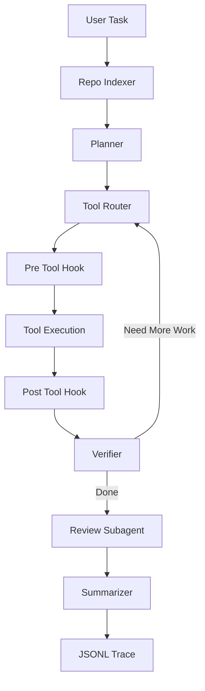

# Coding Agent SFT Lab

一个面向简历项目和后训练实验的轻量级 **Code Repository Agent + Qwen3-8B LoRA SFT** 项目。

项目包含两部分：

1. **Code Agent 原型**：参考 Claude Code / Aider / OpenHands 的公开思路，实现仓库扫描、检索、规划、工具调用、测试验证、Review Subagent 和 JSONL trace 记录。
2. **Agent SFT 实验闭环**：将 Agent 工具轨迹、MBPP/HumanEval、SWE-bench Lite plan 数据转换为 LLaMA-Factory 训练格式，并基于 Qwen3-8B 做 LoRA SFT，对比微调前后效果。

> 说明：本仓库不包含任何私有 API、模型权重、训练 checkpoint 或个人路径。模型权重和训练输出请按文档本地生成。

---

## 项目亮点

- 支持代码仓库索引、Python AST 符号提取和轻量词法检索。
- 使用 LangGraph 编排 Planner → Tool Execution → Verifier → Review → Summary 流程。
- 通过 Tool Registry 统一封装 `read_file`、`grep`、`replace_in_file`、`write_file`、`run_tests`、`git_diff` 等工具。
- 内置 Hook 安全边界，阻止越权路径、危险命令和敏感文件修改。
- 每次 Agent 运行可保存 JSONL trace，用于后续 SFT 数据构建。
- 提供 LLaMA-Factory 数据转换、Qwen3-8B 模型下载、LoRA SFT 和 base/SFT 对比评估脚本。
- 给出完整简历项目写法，展示一个 AI Agent 后训练项目从 0 到 1 的组织方式。

---

## 架构



核心模块：

| 模块 | 文件 | 作用 |
| --- | --- | --- |
| Repo Indexer | `src/cc_agent/repo_indexer.py` | 扫描仓库、读取规则、提取 Python 符号、构建检索上下文 |
| Planner / Actor / Reviewer | `src/cc_agent/graph.py` | LangGraph 工作流编排 |
| Tool Registry | `src/cc_agent/tools.py` | 文件、搜索、编辑、测试、diff 工具封装 |
| Hook System | `src/cc_agent/hooks.py` | 路径、安全命令、敏感文件保护 |
| Trace | `src/cc_agent/tracing.py` | 保存 JSONL 工具轨迹 |
| Trace Stats | `src/cc_agent/trace_stats.py` | 汇总工具成功率、测试通过率、编辑次数 |
| CLI | `src/cc_agent/cli.py` | 命令行入口 |

---

## 目录结构

```text
.
├── src/cc_agent/                  # Code Agent 核心源码
├── scripts/                       # 数据转换、模型下载、训练、评估脚本
├── examples/                      # 可运行的小型样例仓库和 benchmark task
├── data/
│   ├── tasks/                     # 任务清单样例
│   ├── sft/                       # SFT JSONL 样例数据
│   ├── llamafactory/              # LLaMA-Factory alpaca 格式样例数据
│   └── repos/                     # MBPP / HumanEval 生成的小型仓库样例
├── docs/                          # 实验报告和简历写法
├── run_agent.py                   # CLI wrapper
├── requirements.txt
├── pyproject.toml
└── .env.example
```

以下内容默认不入库：`outputs/`、`models/`、`traces/`、`logs/`、`.env`、`.cache/`、`*.safetensors`、`*.log`。

---

## 环境准备

建议使用 Python 3.10+。如果你使用 conda：

```bash
conda create -n coding_agent_sft python=3.10 -y
conda activate coding_agent_sft
pip install -r requirements.txt
```

如果在当前实验环境中复现，也可以使用已有环境：

```bash
conda run -n liuyang_aihigh pip install -r requirements.txt
```

配置模型 API：

```bash
cp .env.example .env
```

编辑 `.env`：

```bash
CC_AGENT_LLM_PROVIDER=openai
OPENAI_API_KEY=sk-your-api-key
OPENAI_BASE_URL=https://api.openai.com/v1
OPENAI_MODEL=gpt-4o-mini
OPENAI_TEMPERATURE=0.1
```

`OPENAI_BASE_URL` 可以替换为任何 OpenAI-compatible API 服务地址。

---

## 运行 Code Agent

### 1. 只预览仓库上下文

```bash
python run_agent.py index --repo examples/sample_repo --query "subtract bug"
```

### 2. 单独运行检索

```bash
python run_agent.py retrieve --repo examples/sample_repo --query "subtract function" --top-k 3
```

### 3. 运行完整 Agent

```bash
python run_agent.py run \
  --repo examples/sample_repo \
  --task "修复 subtract 函数的错误实现" \
  --test-command "pytest -q"
```

每次完整运行会在 `traces/` 目录生成 JSONL 轨迹。轨迹包含计划、工具调用、工具结果、Review 结论和最终总结，可用于后续 SFT。

### 4. 查看 trace 统计

```bash
python run_agent.py stats --path traces
```

---

## 构建 SFT 数据

本项目支持三类数据源：

| 数据源 | 用途 | 输出 |
| --- | --- | --- |
| MBPP | 入门级 Python 编程任务 | 小型 repo + task manifest + SFT JSONL |
| HumanEval | 函数级代码生成任务 | 小型 repo + task manifest + SFT JSONL |
| SWE-bench Lite | 真实 GitHub issue 元数据 | issue → plan / patch SFT 数据 |

### 1. 构建 MBPP / HumanEval 数据

```bash
python run_agent.py build-mbpp --limit 20
python run_agent.py build-humaneval --limit 20
```

如果无法访问外网，代码会生成少量 offline seed 样本，方便先跑通流程。

### 2. 构建 SWE-bench Lite 任务清单

```bash
export HF_ENDPOINT=https://hf-mirror.com
python run_agent.py build-swebench-lite --limit 20
```

### 3. 将 SWE-bench Lite 转成 SFT

生成修复计划数据：

```bash
python run_agent.py swebench-to-sft \
  --input data/tasks/swebench_lite_tasks.jsonl \
  --output data/sft/swebench_lite_plan_sft.jsonl \
  --mode plan
```

生成 patch 数据：

```bash
python run_agent.py swebench-to-sft \
  --input data/tasks/swebench_lite_tasks.jsonl \
  --output data/sft/swebench_lite_patch_sft.jsonl \
  --mode patch
```

### 4. 将 Agent traces 转成 SFT

```bash
python run_agent.py traces-to-sft --trace-path traces --output data/sft/agent_traces_sft.jsonl
```

---

## LLaMA-Factory SFT 实验

### 1. 准备 LLaMA-Factory 数据

```bash
python scripts/prepare_llamafactory_sft.py
```

输出：

```text
data/llamafactory/train_alpaca.json
data/llamafactory/val_alpaca.json
data/llamafactory/dataset_info.json
data/llamafactory/dataset_stats.json
```

当前样例统计：

| 数据集 | 数量 |
| --- | ---: |
| 总样本 | 724 |
| 训练集 | 687 |
| 验证集 | 37 |

### 2. 安装 LLaMA-Factory

```bash
bash scripts/install_llamafactory.sh
```

验证：

```bash
llamafactory-cli --help
```

### 3. 下载 Qwen3-8B

```bash
bash scripts/download_qwen_model.sh
```

默认下载到：

```text
models/Qwen3-8B
```

如果你的磁盘空间有限，可以自定义路径：

```bash
LOCAL_DIR=/path/to/models/Qwen3-8B bash scripts/download_qwen_model.sh
```

### 4. 启动 LoRA SFT

```bash
LOCAL_MODEL_DIR=models/Qwen3-8B \
CUDA_VISIBLE_DEVICES=0 \
bash scripts/train_qwen_supported_llamafactory_lora.sh
```

训练输出默认保存到：

```text
outputs/qwen_supported_coding_agent_lora_llamafactory
```

关键训练配置：

| 参数 | 值 |
| --- | --- |
| Base model | `Qwen/Qwen3-8B` |
| Method | LoRA SFT |
| LoRA rank / alpha | 8 / 32 |
| Effective batch size | 16 |
| cutoff_len | 4096 |
| learning rate | `1e-4` |
| epoch | 1 |
| dtype | bf16 |

---

## 微调前后评估

训练完成后，对比 base model 与 SFT adapter：

```bash
CUDA_VISIBLE_DEVICES=0,1 \
python scripts/eval_before_after_sft.py \
  --base-model models/Qwen3-8B \
  --adapter-dir outputs/qwen_supported_coding_agent_lora_llamafactory \
  --device auto \
  --max-new-tokens 512
```

评估指标：

| 指标 | 含义 |
| --- | --- |
| `json_valid_rate` | 输出是否为合法 JSON |
| `field_hit_rate` | 必填字段是否存在，例如 `plan/tool/arguments` |
| `rouge_l` | 与参考答案的 ROUGE-L F1 |
| `tool_accuracy` | 工具调用任务中 tool 名称是否正确 |
| `file_mention_rate` | SWE-bench plan 中是否命中关键文件 |
| `patch_format_rate` | patch 任务中是否包含 unified diff 标记 |

一次实验结果：

| 指标 | Base | SFT | 提升 |
| --- | ---: | ---: | ---: |
| JSON 格式正确率 | 0.0% | 94.6% | +94.6% |
| 必填字段命中率 | 1.4% | 94.6% | +93.2% |
| ROUGE-L | 10.1% | 73.1% | +63.0% |
| Tool 选择准确率 | 0.0% | 83.3% | +83.3% |
| 文件命中率 | 7.7% | 38.5% | +30.8% |

结果解读：这个提升主要说明 SFT 显著增强了模型对 **Agent 输出协议和 JSON 格式** 的遵循能力；它不等同于真实复杂代码修复能力已经同幅度提升。更严格的下一步应加入 held-out 测试集、真实 patch 执行和端到端 Agent loop 评估。


---

## 简历写法参考

更完整版本见 `docs/RESUME_PROJECT_TEMPLATE.md`。

简历 bullet 示例：

> 构建面向代码仓库任务的轻量级 Coding Agent，支持仓库索引、代码检索、任务规划、工具调用、测试执行、Review Subagent 和 JSONL 轨迹记录；进一步将 Agent traces、MBPP/HumanEval 和 SWE-bench Lite 数据统一转换为 LLaMA-Factory SFT 格式，基于 Qwen3-8B 进行 LoRA SFT，并设计 base/SFT 对比评估脚本。实验中 SFT 后 JSON 合法率从 0.0% 提升到 94.6%，字段命中率从 1.4% 提升到 94.6%，工具选择准确率从 0.0% 提升到 83.3%，验证了 SFT 对 Agent 输出协议对齐的有效性。

---

## 后续扩展

- 引入 tree-sitter 支持更多语言的符号级索引。
- 用 embedding / rerank 替换当前轻量词法检索。
- 扩充高质量真实 Agent traces，减少模板化过拟合。
- 将 patch 样本纳入评估，增加真实测试执行指标。
- 基于工具合法性、测试通过率和 diff 风险设计 RLVR / GRPO / GSPO 后训练实验。
